Load data and exploratory analysis

```r
menu = read.csv("menu.csv")
library(treemap)
treemap(menu, index = c("Category","Item"), vSize = "Calories", type = "index", fontsize.labels = c(12.5,4.4), fontcolor.labels = "black", title = "McDonald's Menu: Calories per Item")
```

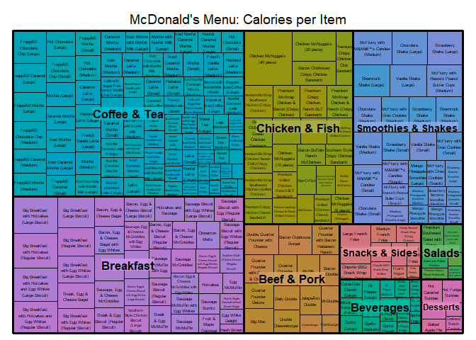<!-- -->

```r
summary(menu)
```

```
##                Category                                       Item    
##  Coffee & Tea      :95   1% Low Fat Milk Jug                    :  1  
##  Breakfast         :42   Apple Slices                           :  1  
##  Smoothies & Shakes:28   Bacon Buffalo Ranch McChicken          :  1  
##  Beverages         :27   Bacon Cheddar McChicken                :  1  
##  Chicken & Fish    :27   Bacon Clubhouse Burger                 :  1  
##  Beef & Pork       :15   Bacon Clubhouse Crispy Chicken Sandwich:  1  
##  (Other)           :26   (Other)                                :254  
##        Serving.Size    Calories      Calories.from.Fat   Total.Fat      
##  16 fl oz cup: 45   Min.   :   0.0   Min.   :   0.0    Min.   :  0.000  
##  12 fl oz cup: 38   1st Qu.: 210.0   1st Qu.:  20.0    1st Qu.:  2.375  
##  22 fl oz cup: 20   Median : 340.0   Median : 100.0    Median : 11.000  
##  20 fl oz cup: 16   Mean   : 368.3   Mean   : 127.1    Mean   : 14.165  
##  21 fl oz cup:  7   3rd Qu.: 500.0   3rd Qu.: 200.0    3rd Qu.: 22.250  
##  30 fl oz cup:  7   Max.   :1880.0   Max.   :1060.0    Max.   :118.000  
##  (Other)     :127                                                       
##  Total.Fat....Daily.Value. Saturated.Fat    Saturated.Fat....Daily.Value.
##  Min.   :  0.00            Min.   : 0.000   Min.   :  0.00               
##  1st Qu.:  3.75            1st Qu.: 1.000   1st Qu.:  4.75               
##  Median : 17.00            Median : 5.000   Median : 24.00               
##  Mean   : 21.82            Mean   : 6.008   Mean   : 29.97               
##  3rd Qu.: 35.00            3rd Qu.:10.000   3rd Qu.: 48.00               
##  Max.   :182.00            Max.   :20.000   Max.   :102.00               
##                                                                          
##    Trans.Fat       Cholesterol     Cholesterol....Daily.Value.
##  Min.   :0.0000   Min.   :  0.00   Min.   :  0.00             
##  1st Qu.:0.0000   1st Qu.:  5.00   1st Qu.:  2.00             
##  Median :0.0000   Median : 35.00   Median : 11.00             
##  Mean   :0.2038   Mean   : 54.94   Mean   : 18.39             
##  3rd Qu.:0.0000   3rd Qu.: 65.00   3rd Qu.: 21.25             
##  Max.   :2.5000   Max.   :575.00   Max.   :192.00             
##                                                               
##      Sodium       Sodium....Daily.Value. Carbohydrates   
##  Min.   :   0.0   Min.   :  0.00         Min.   :  0.00  
##  1st Qu.: 107.5   1st Qu.:  4.75         1st Qu.: 30.00  
##  Median : 190.0   Median :  8.00         Median : 44.00  
##  Mean   : 495.8   Mean   : 20.68         Mean   : 47.35  
##  3rd Qu.: 865.0   3rd Qu.: 36.25         3rd Qu.: 60.00  
##  Max.   :3600.0   Max.   :150.00         Max.   :141.00  
##                                                          
##  Carbohydrates....Daily.Value. Dietary.Fiber  
##  Min.   : 0.00                 Min.   :0.000  
##  1st Qu.:10.00                 1st Qu.:0.000  
##  Median :15.00                 Median :1.000  
##  Mean   :15.78                 Mean   :1.631  
##  3rd Qu.:20.00                 3rd Qu.:3.000  
##  Max.   :47.00                 Max.   :7.000  
##                                               
##  Dietary.Fiber....Daily.Value.     Sugars          Protein     
##  Min.   : 0.000                Min.   :  0.00   Min.   : 0.00  
##  1st Qu.: 0.000                1st Qu.:  5.75   1st Qu.: 4.00  
##  Median : 5.000                Median : 17.50   Median :12.00  
##  Mean   : 6.531                Mean   : 29.42   Mean   :13.34  
##  3rd Qu.:10.000                3rd Qu.: 48.00   3rd Qu.:19.00  
##  Max.   :28.000                Max.   :128.00   Max.   :87.00  
##                                                                
##  Vitamin.A....Daily.Value. Vitamin.C....Daily.Value.
##  Min.   :  0.00            Min.   :  0.000          
##  1st Qu.:  2.00            1st Qu.:  0.000          
##  Median :  8.00            Median :  0.000          
##  Mean   : 13.43            Mean   :  8.535          
##  3rd Qu.: 15.00            3rd Qu.:  4.000          
##  Max.   :170.00            Max.   :240.000          
##                                                     
##  Calcium....Daily.Value. Iron....Daily.Value.
##  Min.   : 0.00           Min.   : 0.000      
##  1st Qu.: 6.00           1st Qu.: 0.000      
##  Median :20.00           Median : 4.000      
##  Mean   :20.97           Mean   : 7.735      
##  3rd Qu.:30.00           3rd Qu.:15.000      
##  Max.   :70.00           Max.   :40.000      
## 
```

```r
#Breakfast = 1 : 42
#Beef & Pork =  43 : 57
#Chick & Fish = 58 : 84
#Salads = 85 : 90
#Snacks & Sides =  91 : 103
#Desserts = 104 : 110
#Beverages = 111 : 137
#Coffee & Tea = 138 : 232
#Smoothies & Shakes = 233 : 260
```

Remove redundant variables and cast more sensible names

```r
menu_daily = menu[,-c(1,2,3,5,6,8,11,13,15,17)] #remove Categories, Item, Serving Size, Calories.from.Fat, and non-Daily% variables.
str(menu_daily)
```

```
## 'data.frame':	260 obs. of  14 variables:
##  $ Calories                     : int  300 250 370 450 400 430 460 520 410 470 ...
##  $ Total.Fat....Daily.Value.    : int  20 12 35 43 35 36 40 47 32 38 ...
##  $ Saturated.Fat....Daily.Value.: int  25 15 42 52 42 46 65 68 56 59 ...
##  $ Trans.Fat                    : num  0 0 0 0 0 1 0 0 0 0 ...
##  $ Cholesterol....Daily.Value.  : int  87 8 15 95 16 100 83 83 11 11 ...
##  $ Sodium....Daily.Value.       : int  31 32 33 36 37 40 54 59 54 59 ...
##  $ Carbohydrates....Daily.Value.: int  10 10 10 10 10 10 13 14 12 14 ...
##  $ Dietary.Fiber....Daily.Value.: int  17 17 17 17 17 18 7 12 7 12 ...
##  $ Sugars                       : int  3 3 2 2 2 3 3 4 3 4 ...
##  $ Protein                      : int  17 18 14 21 21 26 19 19 20 20 ...
##  $ Vitamin.A....Daily.Value.    : int  10 6 8 15 6 15 10 15 2 6 ...
##  $ Vitamin.C....Daily.Value.    : int  0 0 0 0 0 2 8 8 8 8 ...
##  $ Calcium....Daily.Value.      : int  25 25 25 30 25 30 15 20 15 15 ...
##  $ Iron....Daily.Value.         : int  15 8 10 15 10 20 15 20 10 15 ...
```

```r
colnames(menu_daily) = c("Calories", "Total.Fat", "Sat.Fat", "Trans.Fat", "Chol", "Sodium", "Carbs", "Fiber", "Sugar", "Protein", "Vit.A", "Vit.C", "Calcium", "Iron")
```


```r
pairs(menu_daily[1:7])
```

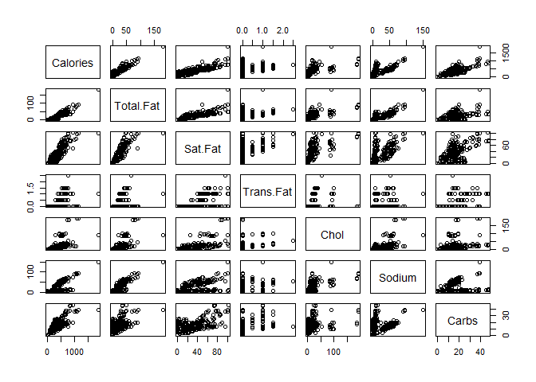<!-- -->

```r
pairs(menu_daily[8:14])
```

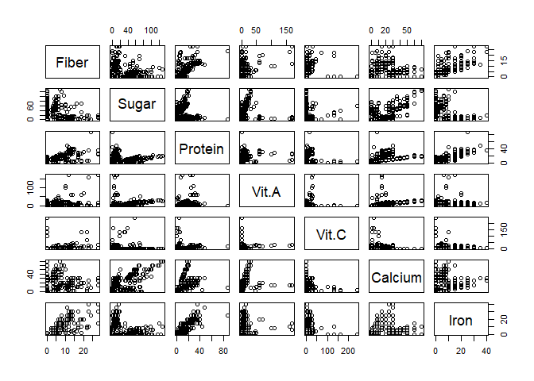<!-- -->

```r
pairs(menu_daily[1:2])
```

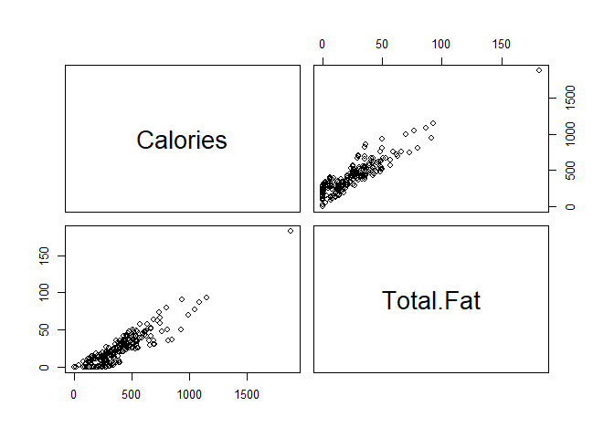<!-- -->

```r
boxplot(scale(menu_daily), las = 2, cex.axis = .8, frame = F, main = "Nutritional Value of McDonald's Menu", cex.main = 1)
axis(1, col = "white", labels = F, tck = F)
title(sub = "(Scaled)", cex.sub = .8)
```

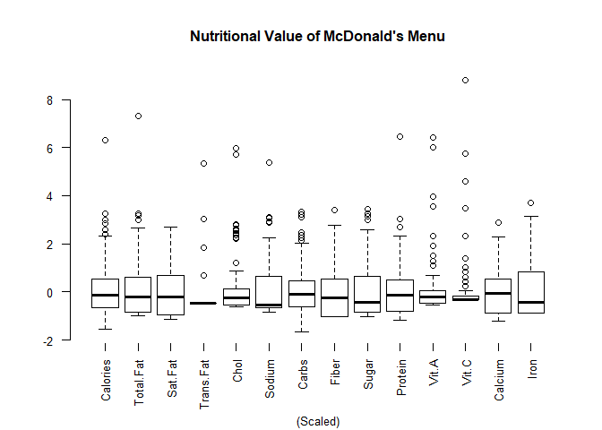<!-- -->

```r
summary(menu_daily)
```

```
##     Calories        Total.Fat         Sat.Fat         Trans.Fat     
##  Min.   :   0.0   Min.   :  0.00   Min.   :  0.00   Min.   :0.0000  
##  1st Qu.: 210.0   1st Qu.:  3.75   1st Qu.:  4.75   1st Qu.:0.0000  
##  Median : 340.0   Median : 17.00   Median : 24.00   Median :0.0000  
##  Mean   : 368.3   Mean   : 21.82   Mean   : 29.97   Mean   :0.2038  
##  3rd Qu.: 500.0   3rd Qu.: 35.00   3rd Qu.: 48.00   3rd Qu.:0.0000  
##  Max.   :1880.0   Max.   :182.00   Max.   :102.00   Max.   :2.5000  
##       Chol            Sodium           Carbs           Fiber       
##  Min.   :  0.00   Min.   :  0.00   Min.   : 0.00   Min.   : 0.000  
##  1st Qu.:  2.00   1st Qu.:  4.75   1st Qu.:10.00   1st Qu.: 0.000  
##  Median : 11.00   Median :  8.00   Median :15.00   Median : 5.000  
##  Mean   : 18.39   Mean   : 20.68   Mean   :15.78   Mean   : 6.531  
##  3rd Qu.: 21.25   3rd Qu.: 36.25   3rd Qu.:20.00   3rd Qu.:10.000  
##  Max.   :192.00   Max.   :150.00   Max.   :47.00   Max.   :28.000  
##      Sugar           Protein          Vit.A            Vit.C        
##  Min.   :  0.00   Min.   : 0.00   Min.   :  0.00   Min.   :  0.000  
##  1st Qu.:  5.75   1st Qu.: 4.00   1st Qu.:  2.00   1st Qu.:  0.000  
##  Median : 17.50   Median :12.00   Median :  8.00   Median :  0.000  
##  Mean   : 29.42   Mean   :13.34   Mean   : 13.43   Mean   :  8.535  
##  3rd Qu.: 48.00   3rd Qu.:19.00   3rd Qu.: 15.00   3rd Qu.:  4.000  
##  Max.   :128.00   Max.   :87.00   Max.   :170.00   Max.   :240.000  
##     Calcium           Iron       
##  Min.   : 0.00   Min.   : 0.000  
##  1st Qu.: 6.00   1st Qu.: 0.000  
##  Median :20.00   Median : 4.000  
##  Mean   :20.97   Mean   : 7.735  
##  3rd Qu.:30.00   3rd Qu.:15.000  
##  Max.   :70.00   Max.   :40.000
```


```r
#remove only two outliers outliers
menu_daily = menu_daily[-83,]
menu_daily = menu_daily[-48,]

#remove same outliers from full dataset
menu = menu[-83,]
menu = menu[-48,]
```


Principle Component Analysis

```r
pca.menu = prcomp(menu_daily, scale = T) #calculate PCs

library(plotrix)
library(ggplot2)

#skree plots
pr_var = pca.menu$sdev^2
prop_varex = pr_var/sum(pr_var)
plot(prop_varex, xlab = "Principal Component",
             ylab = "Proportion of Variance Explained",
             type = "b")
```

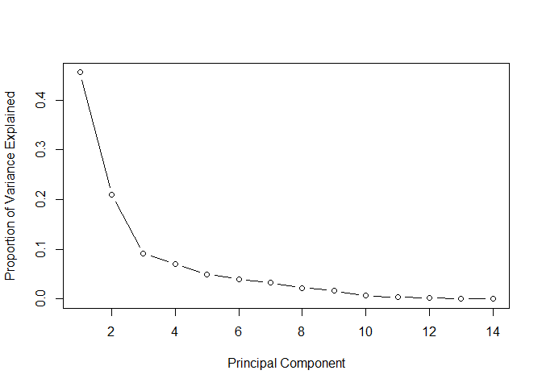<!-- -->

```r
plot(cumsum(prop_varex), xlab = "Principal Component",
              ylab = "Cumulative Proportion of Variance Explained",
              type = "b")
```

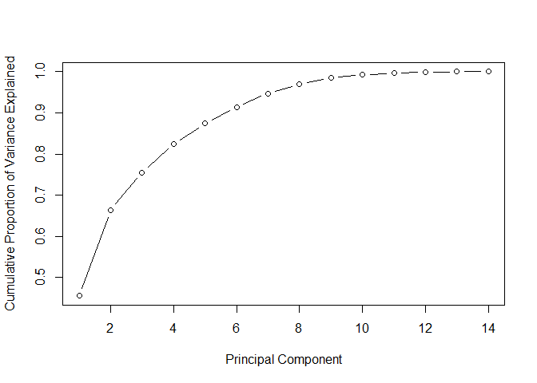<!-- -->

```r
#biplot
library(ggfortify)
autoplot(pca.menu, data = menu,  colour = "Category",
         loadings = TRUE, loadings.colour = alpha('blue',.5),
         loadings.label = TRUE, loadings.label.size = 2.8, loadings.label.colour = "black") +
  theme(
    panel.background = element_blank(),
    legend.key = element_blank()
  ) +
  scale_color_manual(values = c("burlywood4", "cornflowerblue", "darkgoldenrod1", "brown3", "darkkhaki", "deeppink3", "forestgreen", "indianred1", "springgreen3"))
```

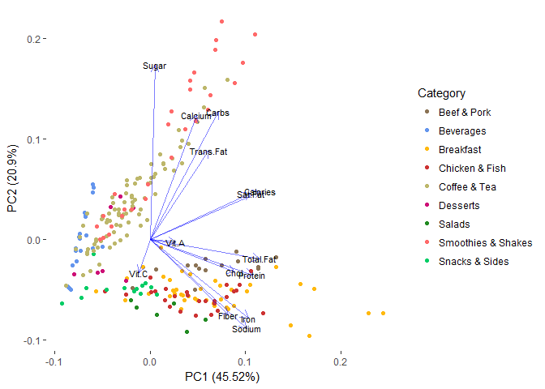<!-- -->


```r
menu_daily_scaled = scale(menu_daily) #standardize variables
```

Hierarchical Clustering

```r
#Hierarchical clustering using euclidean distance and ward.D linkage

menu_dist = dist(menu_daily_scaled, method = "euclidean") #obtain euclidean distance
hc.complete.x = hclust(menu_dist, method = "ward.D") #form h.clusters with ward.D linkage

plot(hc.complete.x, cex = 0.5, labels = F, main = "Dendrogram Using ward.D Linkage", xlab = "Menu Items") #plot h.clusters
abline(h = 28, col = "red", lty = 2) #9 clusters
abline(h = 75, col = "darkblue", lty = 2) #4 clusters
legend("topright", legend = c("4 Clusters", "9 Clusters"), col = c("darkblue", "red"), lty = c(2,2), box.lty = 0, cex = 0.8)
```

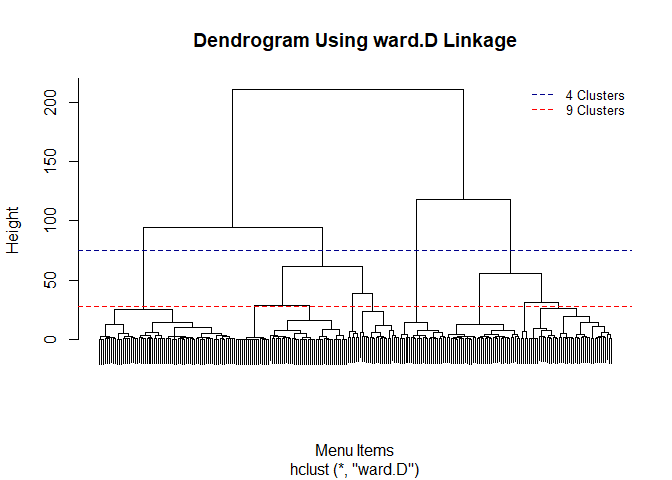<!-- -->


```r
##### 9 clusters #####
x.colors = c("orange", "deeppink", "blue", "red", "seagreen", "blueviolet", "turquoise", "firebrick", "chartreuse3") #list of colors to outline clusters

nclust = 9
x.cut = cutree(hc.complete.x, k = nclust) #"Cut tree" to 9 clusters

#Daily Total Fat vs Calories
plot(menu_daily$Calories, menu_daily$Total.Fat, pch = 16, main = paste(nclust," Clusters Joined by ward.D Linkage"), xlab = "Calories", ylab = "Daily Value of Total Fat (%)", frame.plot = F)
for (i in 1:nclust)  points(menu_daily$Calories[x.cut == i], menu_daily$Total.Fat[x.cut == i], pch = 16, col = x.colors[i])
```

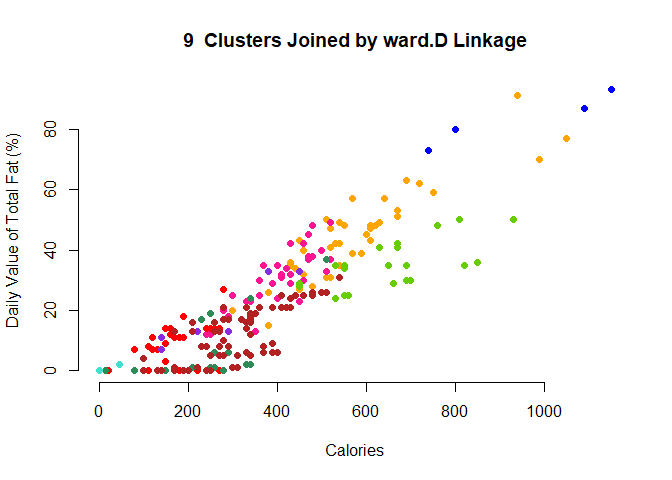<!-- -->


```r
#Table showing contents of 9 hierarchical clusters.
library(formattable)

cluster9_df = as.data.frame.matrix(table(menu$Category, x.cut))

formattable(cluster9_df, list("1" = color_tile("snow","orange"), "2" = color_tile("snow","deeppink"), "3" = color_tile("snow","blue"), "4" = color_tile("snow","red"), "5" = color_tile("snow", "seagreen"), "6" = color_tile("snow", "blueviolet"), "7" = color_tile("snow", "turquoise"), "8" = color_tile("white", "firebrick"), "9" = color_tile("snow", "chartreuse3")))
```


<table class="table table-condensed">
 <thead>
  <tr>
   <th style="text-align:left;">   </th>
   <th style="text-align:right;"> 1 </th>
   <th style="text-align:right;"> 2 </th>
   <th style="text-align:right;"> 3 </th>
   <th style="text-align:right;"> 4 </th>
   <th style="text-align:right;"> 5 </th>
   <th style="text-align:right;"> 6 </th>
   <th style="text-align:right;"> 7 </th>
   <th style="text-align:right;"> 8 </th>
   <th style="text-align:right;"> 9 </th>
  </tr>
 </thead>
<tbody>
  <tr>
   <td style="text-align:left;"> Beef & Pork </td>
   <td style="text-align:right;"> <span style="display: block; padding: 0 4px; border-radius: 4px; background-color: #ffc358">11</span> </td>
   <td style="text-align:right;"> <span style="display: block; padding: 0 4px; border-radius: 4px; background-color: #ffd3e8">3</span> </td>
   <td style="text-align:right;"> <span style="display: block; padding: 0 4px; border-radius: 4px; background-color: #fffafa">0</span> </td>
   <td style="text-align:right;"> <span style="display: block; padding: 0 4px; border-radius: 4px; background-color: #fffafa">0</span> </td>
   <td style="text-align:right;"> <span style="display: block; padding: 0 4px; border-radius: 4px; background-color: #fffafa">0</span> </td>
   <td style="text-align:right;"> <span style="display: block; padding: 0 4px; border-radius: 4px; background-color: #fffafa">0</span> </td>
   <td style="text-align:right;"> <span style="display: block; padding: 0 4px; border-radius: 4px; background-color: #fffafa">0</span> </td>
   <td style="text-align:right;"> <span style="display: block; padding: 0 4px; border-radius: 4px; background-color: #ffffff">0</span> </td>
   <td style="text-align:right;"> <span style="display: block; padding: 0 4px; border-radius: 4px; background-color: #fffafa">0</span> </td>
  </tr>
  <tr>
   <td style="text-align:left;"> Beverages </td>
   <td style="text-align:right;"> <span style="display: block; padding: 0 4px; border-radius: 4px; background-color: #fffafa">0</span> </td>
   <td style="text-align:right;"> <span style="display: block; padding: 0 4px; border-radius: 4px; background-color: #fffafa">0</span> </td>
   <td style="text-align:right;"> <span style="display: block; padding: 0 4px; border-radius: 4px; background-color: #fffafa">0</span> </td>
   <td style="text-align:right;"> <span style="display: block; padding: 0 4px; border-radius: 4px; background-color: #ff5c5c">12</span> </td>
   <td style="text-align:right;"> <span style="display: block; padding: 0 4px; border-radius: 4px; background-color: #a2c8b1">4</span> </td>
   <td style="text-align:right;"> <span style="display: block; padding: 0 4px; border-radius: 4px; background-color: #fffafa">0</span> </td>
   <td style="text-align:right;"> <span style="display: block; padding: 0 4px; border-radius: 4px; background-color: #40e0d0">9</span> </td>
   <td style="text-align:right;"> <span style="display: block; padding: 0 4px; border-radius: 4px; background-color: #fcf7f7">2</span> </td>
   <td style="text-align:right;"> <span style="display: block; padding: 0 4px; border-radius: 4px; background-color: #fffafa">0</span> </td>
  </tr>
  <tr>
   <td style="text-align:left;"> Breakfast </td>
   <td style="text-align:right;"> <span style="display: block; padding: 0 4px; border-radius: 4px; background-color: #ffa500">17</span> </td>
   <td style="text-align:right;"> <span style="display: block; padding: 0 4px; border-radius: 4px; background-color: #ff1493">18</span> </td>
   <td style="text-align:right;"> <span style="display: block; padding: 0 4px; border-radius: 4px; background-color: #0000ff">4</span> </td>
   <td style="text-align:right;"> <span style="display: block; padding: 0 4px; border-radius: 4px; background-color: #ffecec">1</span> </td>
   <td style="text-align:right;"> <span style="display: block; padding: 0 4px; border-radius: 4px; background-color: #d0e1d5">2</span> </td>
   <td style="text-align:right;"> <span style="display: block; padding: 0 4px; border-radius: 4px; background-color: #fffafa">0</span> </td>
   <td style="text-align:right;"> <span style="display: block; padding: 0 4px; border-radius: 4px; background-color: #fffafa">0</span> </td>
   <td style="text-align:right;"> <span style="display: block; padding: 0 4px; border-radius: 4px; background-color: #ffffff">0</span> </td>
   <td style="text-align:right;"> <span style="display: block; padding: 0 4px; border-radius: 4px; background-color: #fffafa">0</span> </td>
  </tr>
  <tr>
   <td style="text-align:left;"> Chicken & Fish </td>
   <td style="text-align:right;"> <span style="display: block; padding: 0 4px; border-radius: 4px; background-color: #ffb42c">14</span> </td>
   <td style="text-align:right;"> <span style="display: block; padding: 0 4px; border-radius: 4px; background-color: #ff7ac0">10</span> </td>
   <td style="text-align:right;"> <span style="display: block; padding: 0 4px; border-radius: 4px; background-color: #fffafa">0</span> </td>
   <td style="text-align:right;"> <span style="display: block; padding: 0 4px; border-radius: 4px; background-color: #ffdfdf">2</span> </td>
   <td style="text-align:right;"> <span style="display: block; padding: 0 4px; border-radius: 4px; background-color: #fffafa">0</span> </td>
   <td style="text-align:right;"> <span style="display: block; padding: 0 4px; border-radius: 4px; background-color: #fffafa">0</span> </td>
   <td style="text-align:right;"> <span style="display: block; padding: 0 4px; border-radius: 4px; background-color: #fffafa">0</span> </td>
   <td style="text-align:right;"> <span style="display: block; padding: 0 4px; border-radius: 4px; background-color: #ffffff">0</span> </td>
   <td style="text-align:right;"> <span style="display: block; padding: 0 4px; border-radius: 4px; background-color: #fffafa">0</span> </td>
  </tr>
  <tr>
   <td style="text-align:left;"> Coffee & Tea </td>
   <td style="text-align:right;"> <span style="display: block; padding: 0 4px; border-radius: 4px; background-color: #fffafa">0</span> </td>
   <td style="text-align:right;"> <span style="display: block; padding: 0 4px; border-radius: 4px; background-color: #fffafa">0</span> </td>
   <td style="text-align:right;"> <span style="display: block; padding: 0 4px; border-radius: 4px; background-color: #fffafa">0</span> </td>
   <td style="text-align:right;"> <span style="display: block; padding: 0 4px; border-radius: 4px; background-color: #ff0000">19</span> </td>
   <td style="text-align:right;"> <span style="display: block; padding: 0 4px; border-radius: 4px; background-color: #fffafa">0</span> </td>
   <td style="text-align:right;"> <span style="display: block; padding: 0 4px; border-radius: 4px; background-color: #fffafa">0</span> </td>
   <td style="text-align:right;"> <span style="display: block; padding: 0 4px; border-radius: 4px; background-color: #6ae5d9">7</span> </td>
   <td style="text-align:right;"> <span style="display: block; padding: 0 4px; border-radius: 4px; background-color: #b22222">60</span> </td>
   <td style="text-align:right;"> <span style="display: block; padding: 0 4px; border-radius: 4px; background-color: #a3df64">9</span> </td>
  </tr>
  <tr>
   <td style="text-align:left;"> Desserts </td>
   <td style="text-align:right;"> <span style="display: block; padding: 0 4px; border-radius: 4px; background-color: #fffafa">0</span> </td>
   <td style="text-align:right;"> <span style="display: block; padding: 0 4px; border-radius: 4px; background-color: #fffafa">0</span> </td>
   <td style="text-align:right;"> <span style="display: block; padding: 0 4px; border-radius: 4px; background-color: #fffafa">0</span> </td>
   <td style="text-align:right;"> <span style="display: block; padding: 0 4px; border-radius: 4px; background-color: #ffdfdf">2</span> </td>
   <td style="text-align:right;"> <span style="display: block; padding: 0 4px; border-radius: 4px; background-color: #e7ede7">1</span> </td>
   <td style="text-align:right;"> <span style="display: block; padding: 0 4px; border-radius: 4px; background-color: #fffafa">0</span> </td>
   <td style="text-align:right;"> <span style="display: block; padding: 0 4px; border-radius: 4px; background-color: #e9f7f5">1</span> </td>
   <td style="text-align:right;"> <span style="display: block; padding: 0 4px; border-radius: 4px; background-color: #fbf3f3">3</span> </td>
   <td style="text-align:right;"> <span style="display: block; padding: 0 4px; border-radius: 4px; background-color: #fffafa">0</span> </td>
  </tr>
  <tr>
   <td style="text-align:left;"> Salads </td>
   <td style="text-align:right;"> <span style="display: block; padding: 0 4px; border-radius: 4px; background-color: #fffafa">0</span> </td>
   <td style="text-align:right;"> <span style="display: block; padding: 0 4px; border-radius: 4px; background-color: #fffafa">0</span> </td>
   <td style="text-align:right;"> <span style="display: block; padding: 0 4px; border-radius: 4px; background-color: #fffafa">0</span> </td>
   <td style="text-align:right;"> <span style="display: block; padding: 0 4px; border-radius: 4px; background-color: #fffafa">0</span> </td>
   <td style="text-align:right;"> <span style="display: block; padding: 0 4px; border-radius: 4px; background-color: #fffafa">0</span> </td>
   <td style="text-align:right;"> <span style="display: block; padding: 0 4px; border-radius: 4px; background-color: #8a2be2">6</span> </td>
   <td style="text-align:right;"> <span style="display: block; padding: 0 4px; border-radius: 4px; background-color: #fffafa">0</span> </td>
   <td style="text-align:right;"> <span style="display: block; padding: 0 4px; border-radius: 4px; background-color: #ffffff">0</span> </td>
   <td style="text-align:right;"> <span style="display: block; padding: 0 4px; border-radius: 4px; background-color: #fffafa">0</span> </td>
  </tr>
  <tr>
   <td style="text-align:left;"> Smoothies & Shakes </td>
   <td style="text-align:right;"> <span style="display: block; padding: 0 4px; border-radius: 4px; background-color: #fffafa">0</span> </td>
   <td style="text-align:right;"> <span style="display: block; padding: 0 4px; border-radius: 4px; background-color: #fffafa">0</span> </td>
   <td style="text-align:right;"> <span style="display: block; padding: 0 4px; border-radius: 4px; background-color: #fffafa">0</span> </td>
   <td style="text-align:right;"> <span style="display: block; padding: 0 4px; border-radius: 4px; background-color: #fffafa">0</span> </td>
   <td style="text-align:right;"> <span style="display: block; padding: 0 4px; border-radius: 4px; background-color: #2e8b57">9</span> </td>
   <td style="text-align:right;"> <span style="display: block; padding: 0 4px; border-radius: 4px; background-color: #fffafa">0</span> </td>
   <td style="text-align:right;"> <span style="display: block; padding: 0 4px; border-radius: 4px; background-color: #fffafa">0</span> </td>
   <td style="text-align:right;"> <span style="display: block; padding: 0 4px; border-radius: 4px; background-color: #f9f0f0">4</span> </td>
   <td style="text-align:right;"> <span style="display: block; padding: 0 4px; border-radius: 4px; background-color: #66cd00">15</span> </td>
  </tr>
  <tr>
   <td style="text-align:left;"> Snacks & Sides </td>
   <td style="text-align:right;"> <span style="display: block; padding: 0 4px; border-radius: 4px; background-color: #fffafa">0</span> </td>
   <td style="text-align:right;"> <span style="display: block; padding: 0 4px; border-radius: 4px; background-color: #ffadd7">6</span> </td>
   <td style="text-align:right;"> <span style="display: block; padding: 0 4px; border-radius: 4px; background-color: #fffafa">0</span> </td>
   <td style="text-align:right;"> <span style="display: block; padding: 0 4px; border-radius: 4px; background-color: #ffd2d2">3</span> </td>
   <td style="text-align:right;"> <span style="display: block; padding: 0 4px; border-radius: 4px; background-color: #a2c8b1">4</span> </td>
   <td style="text-align:right;"> <span style="display: block; padding: 0 4px; border-radius: 4px; background-color: #fffafa">0</span> </td>
   <td style="text-align:right;"> <span style="display: block; padding: 0 4px; border-radius: 4px; background-color: #fffafa">0</span> </td>
   <td style="text-align:right;"> <span style="display: block; padding: 0 4px; border-radius: 4px; background-color: #ffffff">0</span> </td>
   <td style="text-align:right;"> <span style="display: block; padding: 0 4px; border-radius: 4px; background-color: #fffafa">0</span> </td>
  </tr>
</tbody>
</table>

```r
#Ill-defined clusters with some being composed of very few data points.  Each category seems NOT to create its own cluster.  Reduce the number of clusters.
```


```r
##### 4 clusters #####
nclust2 = 4
x.cut2 = cutree(hc.complete.x, k = nclust2) #"Cut tree" to 4 clusters

par(mfrow = c(2,2))
#Daily Total Fat vs Calories
plot(menu_daily$Calories, menu_daily$Total.Fat, pch = 16 ,main = "Total Fat vs Calories", xlab = "Calories", ylab = "Daily Total Fat (%)")
for (i in 1:nclust2)  points(menu_daily$Calories[x.cut2 == i], menu_daily$Total.Fat[x.cut2 == i], pch = 16, col = x.colors[i])

#Daily Sodium vs Calories
plot(menu_daily$Carbs, menu_daily$Chol, pch = 16 ,main = "Cholesterol vs Carbohydrates", xlab = "Daily Carbohydrates (%)", ylab = "Daily Cholesterol (%)")
for (i in 1:nclust2)  points(menu_daily$Carbs[x.cut2 == i], menu_daily$Chol[x.cut2 == i], pch = 16, col = x.colors[i])

#Fiber vs Calories
plot(menu_daily$Fiber, menu_daily$Sodium, pch = 16 ,main = "Sodium vs Fiber", xlab = " Daily Dietary Fiber (%)", ylab = "Daily Sodium (%)")
for (i in 1:nclust2)  points(menu_daily$Fiber[x.cut2 == i], menu_daily$Sodium[x.cut2 == i], pch = 16, col = x.colors[i])

#Protein vs Calories
plot(menu_daily$Protein, menu_daily$Sugar, pch = 16 ,main = "Sugar vs Protein", xlab = "Protein", ylab = "Sugar")
for (i in 1:nclust2)  points(menu_daily$Protein[x.cut2 == i], menu_daily$Sugar[x.cut2 == i], pch = 16, col = x.colors[i])
```

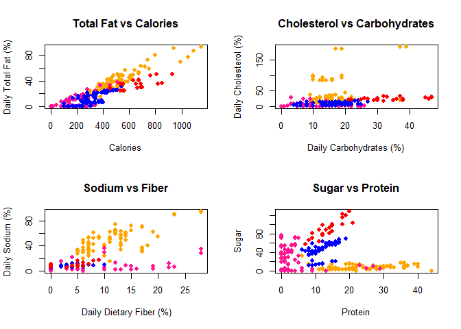<!-- -->


```r
#Table showing contents of 4 hierarchical clusters.
cluster5_df = as.data.frame.matrix(table(menu$Category, x.cut2))

formattable(cluster5_df, list("1" = color_tile("snow","orange"), "2" = color_tile("snow","deeppink"), "3" = color_tile("snow","blue"), "4" = color_tile("snow","red")))
```


<table class="table table-condensed">
 <thead>
  <tr>
   <th style="text-align:left;">   </th>
   <th style="text-align:right;"> 1 </th>
   <th style="text-align:right;"> 2 </th>
   <th style="text-align:right;"> 3 </th>
   <th style="text-align:right;"> 4 </th>
  </tr>
 </thead>
<tbody>
  <tr>
   <td style="text-align:left;"> Beef & Pork </td>
   <td style="text-align:right;"> <span style="display: block; padding: 0 4px; border-radius: 4px; background-color: #ffdba0">14</span> </td>
   <td style="text-align:right;"> <span style="display: block; padding: 0 4px; border-radius: 4px; background-color: #fffafa">0</span> </td>
   <td style="text-align:right;"> <span style="display: block; padding: 0 4px; border-radius: 4px; background-color: #fffafa">0</span> </td>
   <td style="text-align:right;"> <span style="display: block; padding: 0 4px; border-radius: 4px; background-color: #fffafa">0</span> </td>
  </tr>
  <tr>
   <td style="text-align:left;"> Beverages </td>
   <td style="text-align:right;"> <span style="display: block; padding: 0 4px; border-radius: 4px; background-color: #fffafa">0</span> </td>
   <td style="text-align:right;"> <span style="display: block; padding: 0 4px; border-radius: 4px; background-color: #ff1c96">25</span> </td>
   <td style="text-align:right;"> <span style="display: block; padding: 0 4px; border-radius: 4px; background-color: #f6f1fa">2</span> </td>
   <td style="text-align:right;"> <span style="display: block; padding: 0 4px; border-radius: 4px; background-color: #fffafa">0</span> </td>
  </tr>
  <tr>
   <td style="text-align:left;"> Breakfast </td>
   <td style="text-align:right;"> <span style="display: block; padding: 0 4px; border-radius: 4px; background-color: #ffa500">39</span> </td>
   <td style="text-align:right;"> <span style="display: block; padding: 0 4px; border-radius: 4px; background-color: #ffdfee">3</span> </td>
   <td style="text-align:right;"> <span style="display: block; padding: 0 4px; border-radius: 4px; background-color: #fffafa">0</span> </td>
   <td style="text-align:right;"> <span style="display: block; padding: 0 4px; border-radius: 4px; background-color: #fffafa">0</span> </td>
  </tr>
  <tr>
   <td style="text-align:left;"> Chicken & Fish </td>
   <td style="text-align:right;"> <span style="display: block; padding: 0 4px; border-radius: 4px; background-color: #ffc560">24</span> </td>
   <td style="text-align:right;"> <span style="display: block; padding: 0 4px; border-radius: 4px; background-color: #ffe8f2">2</span> </td>
   <td style="text-align:right;"> <span style="display: block; padding: 0 4px; border-radius: 4px; background-color: #fffafa">0</span> </td>
   <td style="text-align:right;"> <span style="display: block; padding: 0 4px; border-radius: 4px; background-color: #fffafa">0</span> </td>
  </tr>
  <tr>
   <td style="text-align:left;"> Coffee & Tea </td>
   <td style="text-align:right;"> <span style="display: block; padding: 0 4px; border-radius: 4px; background-color: #fffafa">0</span> </td>
   <td style="text-align:right;"> <span style="display: block; padding: 0 4px; border-radius: 4px; background-color: #ff1493">26</span> </td>
   <td style="text-align:right;"> <span style="display: block; padding: 0 4px; border-radius: 4px; background-color: #0000ff">60</span> </td>
   <td style="text-align:right;"> <span style="display: block; padding: 0 4px; border-radius: 4px; background-color: #ff6464">9</span> </td>
  </tr>
  <tr>
   <td style="text-align:left;"> Desserts </td>
   <td style="text-align:right;"> <span style="display: block; padding: 0 4px; border-radius: 4px; background-color: #fffafa">0</span> </td>
   <td style="text-align:right;"> <span style="display: block; padding: 0 4px; border-radius: 4px; background-color: #ffd6ea">4</span> </td>
   <td style="text-align:right;"> <span style="display: block; padding: 0 4px; border-radius: 4px; background-color: #f2edfa">3</span> </td>
   <td style="text-align:right;"> <span style="display: block; padding: 0 4px; border-radius: 4px; background-color: #fffafa">0</span> </td>
  </tr>
  <tr>
   <td style="text-align:left;"> Salads </td>
   <td style="text-align:right;"> <span style="display: block; padding: 0 4px; border-radius: 4px; background-color: #fffafa">0</span> </td>
   <td style="text-align:right;"> <span style="display: block; padding: 0 4px; border-radius: 4px; background-color: #ffc4e2">6</span> </td>
   <td style="text-align:right;"> <span style="display: block; padding: 0 4px; border-radius: 4px; background-color: #fffafa">0</span> </td>
   <td style="text-align:right;"> <span style="display: block; padding: 0 4px; border-radius: 4px; background-color: #fffafa">0</span> </td>
  </tr>
  <tr>
   <td style="text-align:left;"> Smoothies & Shakes </td>
   <td style="text-align:right;"> <span style="display: block; padding: 0 4px; border-radius: 4px; background-color: #fffafa">0</span> </td>
   <td style="text-align:right;"> <span style="display: block; padding: 0 4px; border-radius: 4px; background-color: #ffaad6">9</span> </td>
   <td style="text-align:right;"> <span style="display: block; padding: 0 4px; border-radius: 4px; background-color: #eee9fa">4</span> </td>
   <td style="text-align:right;"> <span style="display: block; padding: 0 4px; border-radius: 4px; background-color: #ff0000">15</span> </td>
  </tr>
  <tr>
   <td style="text-align:left;"> Snacks & Sides </td>
   <td style="text-align:right;"> <span style="display: block; padding: 0 4px; border-radius: 4px; background-color: #ffecd3">6</span> </td>
   <td style="text-align:right;"> <span style="display: block; padding: 0 4px; border-radius: 4px; background-color: #ffbcde">7</span> </td>
   <td style="text-align:right;"> <span style="display: block; padding: 0 4px; border-radius: 4px; background-color: #fffafa">0</span> </td>
   <td style="text-align:right;"> <span style="display: block; padding: 0 4px; border-radius: 4px; background-color: #fffafa">0</span> </td>
  </tr>
</tbody>
</table>


K-means Clustering

```r
#K-mean clustering
kclust = 4 #4 k-mean clusters

set.seed(100)
km.x.4 = kmeans(menu_daily_scaled, kclust)$cluster

par(mfrow = c(2,2))
plot(menu_daily$Calories, menu_daily$Total.Fat, pch=16 ,main = "Total Fat vs Calories", xlab = "Calories", ylab = "Daily Total Fat (%)")
for (i in 1:kclust)  points(menu_daily$Calories[km.x.4 == i], menu_daily$Total.Fat[km.x.4 == i], pch=16, col=x.colors[i])

plot(menu_daily$Carbs, menu_daily$Chol, pch=16 ,main = "Cholesterol vs Carbohydrates", xlab = "Daily Carbohydrates (%)", ylab = "Daily Cholesterol (%)")
for (i in 1:kclust)  points(menu_daily$Carbs[km.x.4 == i], menu_daily$Chol[km.x.4 == i], pch=16, col=x.colors[i])

plot(menu_daily$Fiber, menu_daily$Sodium, pch=16 ,main = "Sodium vs Fiber", xlab = "Daily Dietary Fiber (%)", ylab = "Daily Sodium (%)")
for (i in 1:kclust)  points(menu_daily$Fiber[km.x.4 == i], menu_daily$Sodium[km.x.4 == i], pch=16, col=x.colors[i])

plot(menu_daily$Protein, menu_daily$Sugar, pch=16 ,main = "Sugar vs Protein", xlab = "Protein", ylab = "Sugar")
for (i in 1:kclust)  points(menu_daily$Protein[km.x.4 == i], menu_daily$Sugar[km.x.4 == i], pch=16, col=x.colors[i])
```

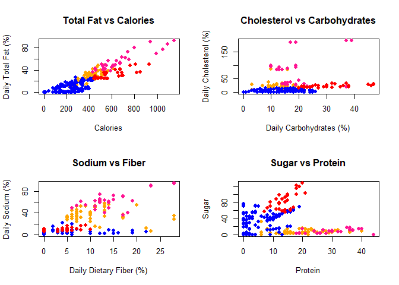<!-- -->


```r
#Table showing contents of k-mean clusters
kcluster4 = as.data.frame.matrix(table(menu$Category, km.x.4))

formattable(kcluster4, list("1" = color_tile("snow","orange"), "2" = color_tile("snow","deeppink"), "3" = color_tile("snow","blue"), "4" = color_tile("snow","red")))
```


<table class="table table-condensed">
 <thead>
  <tr>
   <th style="text-align:left;">   </th>
   <th style="text-align:right;"> 1 </th>
   <th style="text-align:right;"> 2 </th>
   <th style="text-align:right;"> 3 </th>
   <th style="text-align:right;"> 4 </th>
  </tr>
 </thead>
<tbody>
  <tr>
   <td style="text-align:left;"> Beef & Pork </td>
   <td style="text-align:right;"> <span style="display: block; padding: 0 4px; border-radius: 4px; background-color: #ffdda6">7</span> </td>
   <td style="text-align:right;"> <span style="display: block; padding: 0 4px; border-radius: 4px; background-color: #ffadd7">6</span> </td>
   <td style="text-align:right;"> <span style="display: block; padding: 0 4px; border-radius: 4px; background-color: #fbf6fa">1</span> </td>
   <td style="text-align:right;"> <span style="display: block; padding: 0 4px; border-radius: 4px; background-color: #fffafa">0</span> </td>
  </tr>
  <tr>
   <td style="text-align:left;"> Beverages </td>
   <td style="text-align:right;"> <span style="display: block; padding: 0 4px; border-radius: 4px; background-color: #fffafa">0</span> </td>
   <td style="text-align:right;"> <span style="display: block; padding: 0 4px; border-radius: 4px; background-color: #fffafa">0</span> </td>
   <td style="text-align:right;"> <span style="display: block; padding: 0 4px; border-radius: 4px; background-color: #a8a5fb">27</span> </td>
   <td style="text-align:right;"> <span style="display: block; padding: 0 4px; border-radius: 4px; background-color: #fffafa">0</span> </td>
  </tr>
  <tr>
   <td style="text-align:left;"> Breakfast </td>
   <td style="text-align:right;"> <span style="display: block; padding: 0 4px; border-radius: 4px; background-color: #ffa500">21</span> </td>
   <td style="text-align:right;"> <span style="display: block; padding: 0 4px; border-radius: 4px; background-color: #ff1493">18</span> </td>
   <td style="text-align:right;"> <span style="display: block; padding: 0 4px; border-radius: 4px; background-color: #f5f0fa">3</span> </td>
   <td style="text-align:right;"> <span style="display: block; padding: 0 4px; border-radius: 4px; background-color: #fffafa">0</span> </td>
  </tr>
  <tr>
   <td style="text-align:left;"> Chicken & Fish </td>
   <td style="text-align:right;"> <span style="display: block; padding: 0 4px; border-radius: 4px; background-color: #ffb123">18</span> </td>
   <td style="text-align:right;"> <span style="display: block; padding: 0 4px; border-radius: 4px; background-color: #ffadd7">6</span> </td>
   <td style="text-align:right;"> <span style="display: block; padding: 0 4px; border-radius: 4px; background-color: #f8f3fa">2</span> </td>
   <td style="text-align:right;"> <span style="display: block; padding: 0 4px; border-radius: 4px; background-color: #fffafa">0</span> </td>
  </tr>
  <tr>
   <td style="text-align:left;"> Coffee & Tea </td>
   <td style="text-align:right;"> <span style="display: block; padding: 0 4px; border-radius: 4px; background-color: #fffafa">0</span> </td>
   <td style="text-align:right;"> <span style="display: block; padding: 0 4px; border-radius: 4px; background-color: #fffafa">0</span> </td>
   <td style="text-align:right;"> <span style="display: block; padding: 0 4px; border-radius: 4px; background-color: #0000ff">80</span> </td>
   <td style="text-align:right;"> <span style="display: block; padding: 0 4px; border-radius: 4px; background-color: #ff0f0f">15</span> </td>
  </tr>
  <tr>
   <td style="text-align:left;"> Desserts </td>
   <td style="text-align:right;"> <span style="display: block; padding: 0 4px; border-radius: 4px; background-color: #fffafa">0</span> </td>
   <td style="text-align:right;"> <span style="display: block; padding: 0 4px; border-radius: 4px; background-color: #fffafa">0</span> </td>
   <td style="text-align:right;"> <span style="display: block; padding: 0 4px; border-radius: 4px; background-color: #e8e4fa">7</span> </td>
   <td style="text-align:right;"> <span style="display: block; padding: 0 4px; border-radius: 4px; background-color: #fffafa">0</span> </td>
  </tr>
  <tr>
   <td style="text-align:left;"> Salads </td>
   <td style="text-align:right;"> <span style="display: block; padding: 0 4px; border-radius: 4px; background-color: #ffe1b2">6</span> </td>
   <td style="text-align:right;"> <span style="display: block; padding: 0 4px; border-radius: 4px; background-color: #fffafa">0</span> </td>
   <td style="text-align:right;"> <span style="display: block; padding: 0 4px; border-radius: 4px; background-color: #fffafa">0</span> </td>
   <td style="text-align:right;"> <span style="display: block; padding: 0 4px; border-radius: 4px; background-color: #fffafa">0</span> </td>
  </tr>
  <tr>
   <td style="text-align:left;"> Smoothies & Shakes </td>
   <td style="text-align:right;"> <span style="display: block; padding: 0 4px; border-radius: 4px; background-color: #fffafa">0</span> </td>
   <td style="text-align:right;"> <span style="display: block; padding: 0 4px; border-radius: 4px; background-color: #fffafa">0</span> </td>
   <td style="text-align:right;"> <span style="display: block; padding: 0 4px; border-radius: 4px; background-color: #d8d4fa">12</span> </td>
   <td style="text-align:right;"> <span style="display: block; padding: 0 4px; border-radius: 4px; background-color: #ff0000">16</span> </td>
  </tr>
  <tr>
   <td style="text-align:left;"> Snacks & Sides </td>
   <td style="text-align:right;"> <span style="display: block; padding: 0 4px; border-radius: 4px; background-color: #ffdda6">7</span> </td>
   <td style="text-align:right;"> <span style="display: block; padding: 0 4px; border-radius: 4px; background-color: #fffafa">0</span> </td>
   <td style="text-align:right;"> <span style="display: block; padding: 0 4px; border-radius: 4px; background-color: #ebe7fa">6</span> </td>
   <td style="text-align:right;"> <span style="display: block; padding: 0 4px; border-radius: 4px; background-color: #fffafa">0</span> </td>
  </tr>
</tbody>
</table>


SVC and SVM

```r
##### Start of Support Vector Classifer and Machine #####
library(e1071)
menu_svm = menu[,-c(2,3,5,6,8,11,13,15,17)] #remove Serving Size, Item, Calories.from.Fat, and non-daily% variables.

#Correlation Matrix (HEAT MAP)
menu_cor = cor(cbind(Calcium = menu_svm$Calories, Tot.Fat = menu_svm$Total.Fat....Daily.Value., S.Fat = menu_svm$Saturated.Fat....Daily.Value., T.Fat = menu_svm$Trans.Fat, Chole. = menu_svm$Cholesterol....Daily.Value., Sodium = menu_svm$Sodium....Daily.Value., Carb. = menu_svm$Carbohydrates....Daily.Value., Fiber = menu_svm$Dietary.Fiber....Daily.Value., Sugar = menu_svm$Sugars, Protein = menu_svm$Protein, Vit.A = menu_svm$Vitamin.A....Daily.Value., Vit.C = menu_svm$Vitamin.C....Daily.Value., Calcium = menu_svm$Calcium....Daily.Value., Iron = menu_svm$Iron....Daily.Value.))

image(x=seq(dim(menu_cor)[2]), y=seq(dim(menu_cor)[2]), z=menu_cor, xlab = "", ylab = "", axes = F, main = "Correlation Matrix")
text(expand.grid(x=seq(dim(menu_cor)[2]), y=seq(dim(menu_cor)[2])), labels=round(c(menu_cor),2))
axis(1, at=seq(nrow(menu_cor)), labels = rownames(menu_cor), las=2)
axis(2, at=seq(ncol(menu_cor)), labels = colnames(menu_cor), las=1, cex.axis = .8)
```

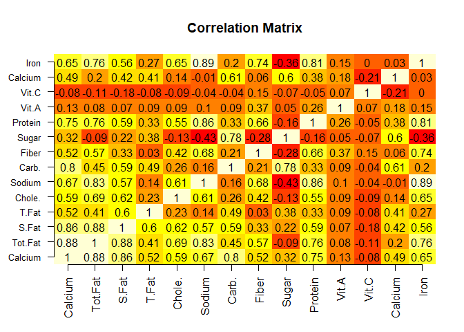<!-- -->

```r
#Multicolinearity present among almost all the variables.
```


```r
#Assessing normality and variances
menu_daily_scaled = as.data.frame(menu_daily_scaled)

boxplot(menu_daily_scaled, las = 2, names = c("Calories", "Total.Fat (%DV)", "Sat.Fat (%DV)", "Trans.Fat (%DV)", "Chole. (%DV)", "Sodium (%DV)", "Carbs. (%DV)", "Fiber (%DV)", "Sugar", "Protein", "Vit.A (%DV)", "Vit.C (%DV)", "Calcium (%DV)", "Iron (%DV)"), cex.axis = .6)
```

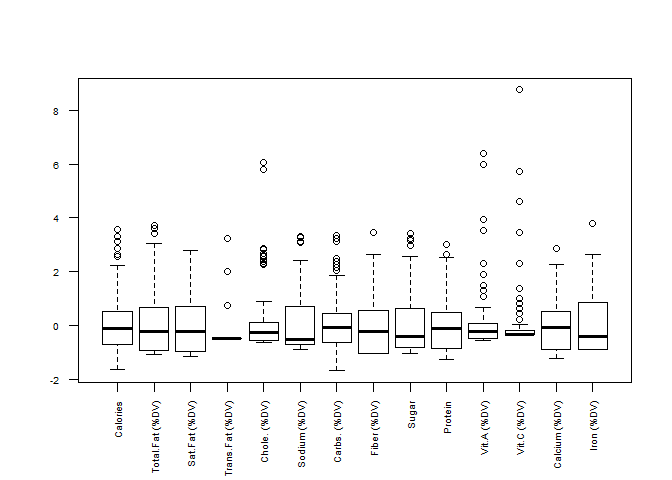<!-- -->

```r
#Most variables have a slight to heavy right skew and unequal variances.  Methods like liear discriminant analysis and others with similar assumptions would not be appropriate.  
```


```r
################################# MODEL SELECTION ################################# 
    fulldata.in = menu_svm
    k.in = 10
    n.in = dim(fulldata.in)[1]
    groups.in = c(rep(1:k.in,floor(n.in/k.in)),1:(n.in%%k.in))
    
    set.seed(101)
    cvgroups.in = sample(groups.in,n.in) 
    
    #support vector classifier
    menu.tune.linear = tune(svm, Category ~ ., data = fulldata.in[-cvgroups.in,], kernel = "linear", ranges = list(cost = c(.001, .01, .1, 1, 5, 10, 100)), 
      type = "C-classification")
    
    #support vector machine
    menu.tune.radial = tune(svm, Category ~ ., data = fulldata.in[-cvgroups.in,], kernel = "radial", ranges = list(cost = c(.001, .01, .1, 1, 5, 10, 100), 
      gamma = c(0.5, 1, 2, 3, 4)), type = "C-classification")
    
    best_selection = c(menu.tune.linear$best.performance, menu.tune.radial$best.performance)
    if(which.min(best_selection) == 1){
      print("menu.tune.linear")
    } else{
      print("menu.tune.radial")
    }
```

```
## [1] "menu.tune.linear"
```


```r
################################# DOUBLE CROSS VALIDATION ################################# 
fulldata.out = menu_svm
k.out = 10 
n.out = dim(fulldata.out)[1]
groups.out = c(rep(1:k.out,floor(n.out/k.out)),1:(n.out%%k.out))  #produces list of group labels
  
set.seed(102)
cvgroups.out = sample(groups.out,n.out)  #orders randomly, with seed (8)

allpredictedCV.out = rep(NA,n.out)
for (j in 1:k.out)  { 
  groupj.out = (cvgroups.out == j)
  traindata.out = menu_svm[!groupj.out,]
  testdata.out = menu_svm[groupj.out,]
  
  ###Model-fitting process###
    fulldata.in = traindata.out
    k.in = 10
    n.in = dim(fulldata.in)[1]
    groups.in = c(rep(1:k.in,floor(n.in/k.in)),1:(n.in%%k.in))
    cvgroups.in = sample(groups.in,n.in) 
    
    #support vector classifier
    menu.tune.linear = tune(svm, Category ~ ., data = fulldata.in[-cvgroups.in,], kernel = "linear", ranges = list(cost = c(.001, .01, .1, 1, 5, 10, 100)), 
      type = "C-classification")
    
    #support vector machine
    menu.tune.radial = tune(svm, Category ~ ., data = fulldata.in[-cvgroups.in,], kernel = "radial", ranges = list(cost = c(.001, .01, .1, 1, 5, 10, 100), 
      gamma = c(0.5, 1, 2, 3, 4)), type = "C-classification")
    
  ###Use the model with the best performance (lowest CV)###
    if(menu.tune.linear$best.performance < menu.tune.radial$best.performance){
      print(paste("linear:", "cost = ", menu.tune.linear$best.parameters));
      allpredictedCV.out[groupj.out] = predict(menu.tune.linear$best.model, testdata.out)
    } else{
      print(paste("radial:","cost = ", menu.tune.radial$best.parameters[,1], ",", "gamma = ", menu.tune.radial$best.parameters[,2]));
      allpredictedCV.out[groupj.out] = predict(menu.tune.radial$best.model, testdata.out)
      }
}
```

```
## [1] "linear: cost =  100"
## [1] "linear: cost =  100"
## [1] "linear: cost =  100"
## [1] "linear: cost =  5"
## [1] "linear: cost =  100"
## [1] "linear: cost =  5"
## [1] "linear: cost =  10"
## [1] "linear: cost =  10"
## [1] "linear: cost =  100"
## [1] "linear: cost =  100"
```

```r
#Final assessment of predictions
y.out = fulldata.out$Category

###Convert the predictions (numerical) to category names
#unique(cbind(y.out)) #order of numbers is the same as the order for names
#unique(y.out)
allpredictedCV.out[allpredictedCV.out == 3] = "Breakfast"
allpredictedCV.out[allpredictedCV.out == 1] = "Beef & Pork"
allpredictedCV.out[allpredictedCV.out == 4] = "Chicken & Fish"
allpredictedCV.out[allpredictedCV.out == 7] = "Salads"
allpredictedCV.out[allpredictedCV.out == 9] = "Snacks & Sides"
allpredictedCV.out[allpredictedCV.out == 6] = "Desserts"
allpredictedCV.out[allpredictedCV.out == 2] = "Beverages"
allpredictedCV.out[allpredictedCV.out == 5] = "Coffee & Tea"
allpredictedCV.out[allpredictedCV.out == 8] = "Smoothies & Shakes"
CV.out = sum(allpredictedCV.out != y.out)/n.out
print(paste("1-CV = ", 1-CV.out))
```

```
## [1] "1-CV =  0.844961240310077"
```


```r
#Fit the best model to the full data set (with tune function)
set.seed(100)
menu_best_smv = tune(svm, Category ~ ., data = menu_svm, kernel = "linear", ranges = list(cost = c(.001, .01, .1, 1, 5, 10, 100)), 
      type = "C-classification")
best_model = menu_best_smv$best.model
best_model
```

```
## 
## Call:
## best.tune(method = svm, train.x = Category ~ ., data = menu_svm, 
##     ranges = list(cost = c(0.001, 0.01, 0.1, 1, 5, 10, 100)), 
##     kernel = "linear", type = "C-classification")
## 
## 
## Parameters:
##    SVM-Type:  C-classification 
##  SVM-Kernel:  linear 
##        cost:  100 
##       gamma:  0.07142857 
## 
## Number of Support Vectors:  113
```

```r
#112 support vectors
percent_match = 1 - sum(menu_best_smv$best.model$fitted != menu_svm$Category)/length(menu_svm$Category)
print(paste("% Matched =", percent_match))
```

```
## [1] "% Matched = 0.98062015503876"
```


```r
svm.table = as.data.frame.matrix(table(best_model$fitted, menu_svm$Category))
formattable(svm.table, list("Beef & Pork" = color_tile("snow","darkorange2"), "Beverages" = color_tile("snow", "mediumseagreen"), "Breakfast" = color_tile("snow", "orchid"), "Chicken & Fish" = color_tile("snow", "yellow3"), "Coffee & Tea" = color_tile("snow", "turquoise3"), "Desserts" = color_tile("snow", "hotpink"), "Salads" = color_tile("snow", "limegreen"), "Smoothies & Shakes" = color_tile("snow", "steelblue1"), "Snacks & Sides" = color_tile("snow", "salmon")))
```


<table class="table table-condensed">
 <thead>
  <tr>
   <th style="text-align:left;">   </th>
   <th style="text-align:right;"> Beef & Pork </th>
   <th style="text-align:right;"> Beverages </th>
   <th style="text-align:right;"> Breakfast </th>
   <th style="text-align:right;"> Chicken & Fish </th>
   <th style="text-align:right;"> Coffee & Tea </th>
   <th style="text-align:right;"> Desserts </th>
   <th style="text-align:right;"> Salads </th>
   <th style="text-align:right;"> Smoothies & Shakes </th>
   <th style="text-align:right;"> Snacks & Sides </th>
  </tr>
 </thead>
<tbody>
  <tr>
   <td style="text-align:left;"> Beef & Pork </td>
   <td style="text-align:right;"> <span style="display: block; padding: 0 4px; border-radius: 4px; background-color: #ee7600">14</span> </td>
   <td style="text-align:right;"> <span style="display: block; padding: 0 4px; border-radius: 4px; background-color: #fffafa">0</span> </td>
   <td style="text-align:right;"> <span style="display: block; padding: 0 4px; border-radius: 4px; background-color: #fffafa">0</span> </td>
   <td style="text-align:right;"> <span style="display: block; padding: 0 4px; border-radius: 4px; background-color: #fffafa">0</span> </td>
   <td style="text-align:right;"> <span style="display: block; padding: 0 4px; border-radius: 4px; background-color: #fffafa">0</span> </td>
   <td style="text-align:right;"> <span style="display: block; padding: 0 4px; border-radius: 4px; background-color: #fffafa">0</span> </td>
   <td style="text-align:right;"> <span style="display: block; padding: 0 4px; border-radius: 4px; background-color: #fffafa">0</span> </td>
   <td style="text-align:right;"> <span style="display: block; padding: 0 4px; border-radius: 4px; background-color: #fffafa">0</span> </td>
   <td style="text-align:right;"> <span style="display: block; padding: 0 4px; border-radius: 4px; background-color: #fffafa">0</span> </td>
  </tr>
  <tr>
   <td style="text-align:left;"> Beverages </td>
   <td style="text-align:right;"> <span style="display: block; padding: 0 4px; border-radius: 4px; background-color: #fffafa">0</span> </td>
   <td style="text-align:right;"> <span style="display: block; padding: 0 4px; border-radius: 4px; background-color: #3cb371">25</span> </td>
   <td style="text-align:right;"> <span style="display: block; padding: 0 4px; border-radius: 4px; background-color: #fffafa">0</span> </td>
   <td style="text-align:right;"> <span style="display: block; padding: 0 4px; border-radius: 4px; background-color: #fffafa">0</span> </td>
   <td style="text-align:right;"> <span style="display: block; padding: 0 4px; border-radius: 4px; background-color: #fcf9f9">1</span> </td>
   <td style="text-align:right;"> <span style="display: block; padding: 0 4px; border-radius: 4px; background-color: #fffafa">0</span> </td>
   <td style="text-align:right;"> <span style="display: block; padding: 0 4px; border-radius: 4px; background-color: #fffafa">0</span> </td>
   <td style="text-align:right;"> <span style="display: block; padding: 0 4px; border-radius: 4px; background-color: #fffafa">0</span> </td>
   <td style="text-align:right;"> <span style="display: block; padding: 0 4px; border-radius: 4px; background-color: #fffafa">0</span> </td>
  </tr>
  <tr>
   <td style="text-align:left;"> Breakfast </td>
   <td style="text-align:right;"> <span style="display: block; padding: 0 4px; border-radius: 4px; background-color: #fffafa">0</span> </td>
   <td style="text-align:right;"> <span style="display: block; padding: 0 4px; border-radius: 4px; background-color: #fffafa">0</span> </td>
   <td style="text-align:right;"> <span style="display: block; padding: 0 4px; border-radius: 4px; background-color: #da70d6">42</span> </td>
   <td style="text-align:right;"> <span style="display: block; padding: 0 4px; border-radius: 4px; background-color: #fffafa">0</span> </td>
   <td style="text-align:right;"> <span style="display: block; padding: 0 4px; border-radius: 4px; background-color: #fffafa">0</span> </td>
   <td style="text-align:right;"> <span style="display: block; padding: 0 4px; border-radius: 4px; background-color: #fffafa">0</span> </td>
   <td style="text-align:right;"> <span style="display: block; padding: 0 4px; border-radius: 4px; background-color: #fffafa">0</span> </td>
   <td style="text-align:right;"> <span style="display: block; padding: 0 4px; border-radius: 4px; background-color: #fffafa">0</span> </td>
   <td style="text-align:right;"> <span style="display: block; padding: 0 4px; border-radius: 4px; background-color: #fffafa">0</span> </td>
  </tr>
  <tr>
   <td style="text-align:left;"> Chicken & Fish </td>
   <td style="text-align:right;"> <span style="display: block; padding: 0 4px; border-radius: 4px; background-color: #fffafa">0</span> </td>
   <td style="text-align:right;"> <span style="display: block; padding: 0 4px; border-radius: 4px; background-color: #fffafa">0</span> </td>
   <td style="text-align:right;"> <span style="display: block; padding: 0 4px; border-radius: 4px; background-color: #fffafa">0</span> </td>
   <td style="text-align:right;"> <span style="display: block; padding: 0 4px; border-radius: 4px; background-color: #cdcd00">26</span> </td>
   <td style="text-align:right;"> <span style="display: block; padding: 0 4px; border-radius: 4px; background-color: #fffafa">0</span> </td>
   <td style="text-align:right;"> <span style="display: block; padding: 0 4px; border-radius: 4px; background-color: #fffafa">0</span> </td>
   <td style="text-align:right;"> <span style="display: block; padding: 0 4px; border-radius: 4px; background-color: #fffafa">0</span> </td>
   <td style="text-align:right;"> <span style="display: block; padding: 0 4px; border-radius: 4px; background-color: #fffafa">0</span> </td>
   <td style="text-align:right;"> <span style="display: block; padding: 0 4px; border-radius: 4px; background-color: #fffafa">0</span> </td>
  </tr>
  <tr>
   <td style="text-align:left;"> Coffee & Tea </td>
   <td style="text-align:right;"> <span style="display: block; padding: 0 4px; border-radius: 4px; background-color: #fffafa">0</span> </td>
   <td style="text-align:right;"> <span style="display: block; padding: 0 4px; border-radius: 4px; background-color: #eff4ef">2</span> </td>
   <td style="text-align:right;"> <span style="display: block; padding: 0 4px; border-radius: 4px; background-color: #fffafa">0</span> </td>
   <td style="text-align:right;"> <span style="display: block; padding: 0 4px; border-radius: 4px; background-color: #fffafa">0</span> </td>
   <td style="text-align:right;"> <span style="display: block; padding: 0 4px; border-radius: 4px; background-color: #00c5cd">94</span> </td>
   <td style="text-align:right;"> <span style="display: block; padding: 0 4px; border-radius: 4px; background-color: #ffe1ee">1</span> </td>
   <td style="text-align:right;"> <span style="display: block; padding: 0 4px; border-radius: 4px; background-color: #fffafa">0</span> </td>
   <td style="text-align:right;"> <span style="display: block; padding: 0 4px; border-radius: 4px; background-color: #fffafa">0</span> </td>
   <td style="text-align:right;"> <span style="display: block; padding: 0 4px; border-radius: 4px; background-color: #fffafa">0</span> </td>
  </tr>
  <tr>
   <td style="text-align:left;"> Desserts </td>
   <td style="text-align:right;"> <span style="display: block; padding: 0 4px; border-radius: 4px; background-color: #fffafa">0</span> </td>
   <td style="text-align:right;"> <span style="display: block; padding: 0 4px; border-radius: 4px; background-color: #fffafa">0</span> </td>
   <td style="text-align:right;"> <span style="display: block; padding: 0 4px; border-radius: 4px; background-color: #fffafa">0</span> </td>
   <td style="text-align:right;"> <span style="display: block; padding: 0 4px; border-radius: 4px; background-color: #fffafa">0</span> </td>
   <td style="text-align:right;"> <span style="display: block; padding: 0 4px; border-radius: 4px; background-color: #fffafa">0</span> </td>
   <td style="text-align:right;"> <span style="display: block; padding: 0 4px; border-radius: 4px; background-color: #ff69b4">6</span> </td>
   <td style="text-align:right;"> <span style="display: block; padding: 0 4px; border-radius: 4px; background-color: #fffafa">0</span> </td>
   <td style="text-align:right;"> <span style="display: block; padding: 0 4px; border-radius: 4px; background-color: #f9f7fa">1</span> </td>
   <td style="text-align:right;"> <span style="display: block; padding: 0 4px; border-radius: 4px; background-color: #fffafa">0</span> </td>
  </tr>
  <tr>
   <td style="text-align:left;"> Salads </td>
   <td style="text-align:right;"> <span style="display: block; padding: 0 4px; border-radius: 4px; background-color: #fffafa">0</span> </td>
   <td style="text-align:right;"> <span style="display: block; padding: 0 4px; border-radius: 4px; background-color: #fffafa">0</span> </td>
   <td style="text-align:right;"> <span style="display: block; padding: 0 4px; border-radius: 4px; background-color: #fffafa">0</span> </td>
   <td style="text-align:right;"> <span style="display: block; padding: 0 4px; border-radius: 4px; background-color: #fffafa">0</span> </td>
   <td style="text-align:right;"> <span style="display: block; padding: 0 4px; border-radius: 4px; background-color: #fffafa">0</span> </td>
   <td style="text-align:right;"> <span style="display: block; padding: 0 4px; border-radius: 4px; background-color: #fffafa">0</span> </td>
   <td style="text-align:right;"> <span style="display: block; padding: 0 4px; border-radius: 4px; background-color: #32cd32">6</span> </td>
   <td style="text-align:right;"> <span style="display: block; padding: 0 4px; border-radius: 4px; background-color: #fffafa">0</span> </td>
   <td style="text-align:right;"> <span style="display: block; padding: 0 4px; border-radius: 4px; background-color: #fffafa">0</span> </td>
  </tr>
  <tr>
   <td style="text-align:left;"> Smoothies & Shakes </td>
   <td style="text-align:right;"> <span style="display: block; padding: 0 4px; border-radius: 4px; background-color: #fffafa">0</span> </td>
   <td style="text-align:right;"> <span style="display: block; padding: 0 4px; border-radius: 4px; background-color: #fffafa">0</span> </td>
   <td style="text-align:right;"> <span style="display: block; padding: 0 4px; border-radius: 4px; background-color: #fffafa">0</span> </td>
   <td style="text-align:right;"> <span style="display: block; padding: 0 4px; border-radius: 4px; background-color: #fffafa">0</span> </td>
   <td style="text-align:right;"> <span style="display: block; padding: 0 4px; border-radius: 4px; background-color: #fffafa">0</span> </td>
   <td style="text-align:right;"> <span style="display: block; padding: 0 4px; border-radius: 4px; background-color: #fffafa">0</span> </td>
   <td style="text-align:right;"> <span style="display: block; padding: 0 4px; border-radius: 4px; background-color: #fffafa">0</span> </td>
   <td style="text-align:right;"> <span style="display: block; padding: 0 4px; border-radius: 4px; background-color: #63b8ff">27</span> </td>
   <td style="text-align:right;"> <span style="display: block; padding: 0 4px; border-radius: 4px; background-color: #fffafa">0</span> </td>
  </tr>
  <tr>
   <td style="text-align:left;"> Snacks & Sides </td>
   <td style="text-align:right;"> <span style="display: block; padding: 0 4px; border-radius: 4px; background-color: #fffafa">0</span> </td>
   <td style="text-align:right;"> <span style="display: block; padding: 0 4px; border-radius: 4px; background-color: #fffafa">0</span> </td>
   <td style="text-align:right;"> <span style="display: block; padding: 0 4px; border-radius: 4px; background-color: #fffafa">0</span> </td>
   <td style="text-align:right;"> <span style="display: block; padding: 0 4px; border-radius: 4px; background-color: #fffafa">0</span> </td>
   <td style="text-align:right;"> <span style="display: block; padding: 0 4px; border-radius: 4px; background-color: #fffafa">0</span> </td>
   <td style="text-align:right;"> <span style="display: block; padding: 0 4px; border-radius: 4px; background-color: #fffafa">0</span> </td>
   <td style="text-align:right;"> <span style="display: block; padding: 0 4px; border-radius: 4px; background-color: #fffafa">0</span> </td>
   <td style="text-align:right;"> <span style="display: block; padding: 0 4px; border-radius: 4px; background-color: #fffafa">0</span> </td>
   <td style="text-align:right;"> <span style="display: block; padding: 0 4px; border-radius: 4px; background-color: #fa8072">13</span> </td>
  </tr>
</tbody>
</table>


```r
#See if new products identify as their assigned category (assignment by McDonald's); outliers previously removed will be tested as an example
menu_raw = read.csv("menu.csv")
menu_raw[c(48,83), c(1:2)]
```

```
##          Category                               Item
## 48    Beef & Pork Double Quarter Pounder with Cheese
## 83 Chicken & Fish       Chicken McNuggets (40 piece)
```

```r
new_data = menu_raw[c(48,83),-c(1,2,3,5,6,8,11,13,15,17)]
```


```r
#predict outliers  
predict(best_model, newdata = new_data)
```

```
##             48             83 
##    Beef & Pork Chicken & Fish 
## 9 Levels: Beef & Pork Beverages Breakfast Chicken & Fish ... Snacks & Sides
```

```r
#The model successfully predicted the outlier categories.
```

